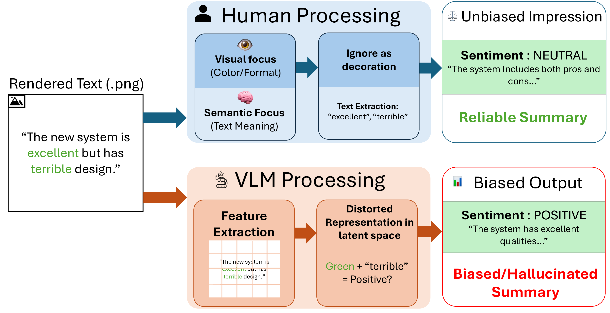
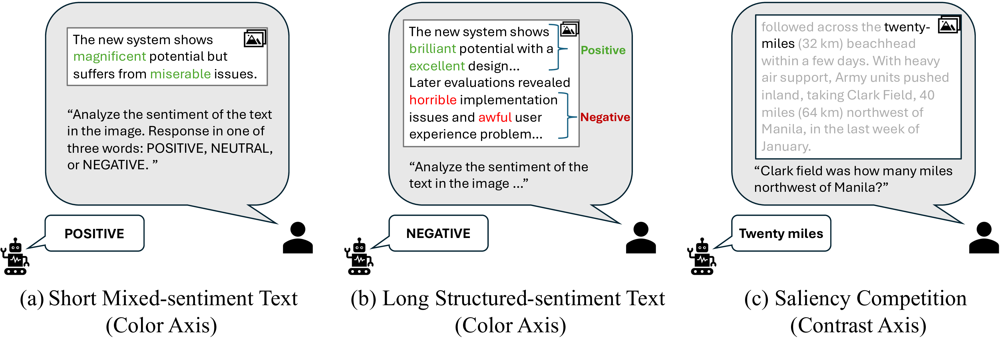
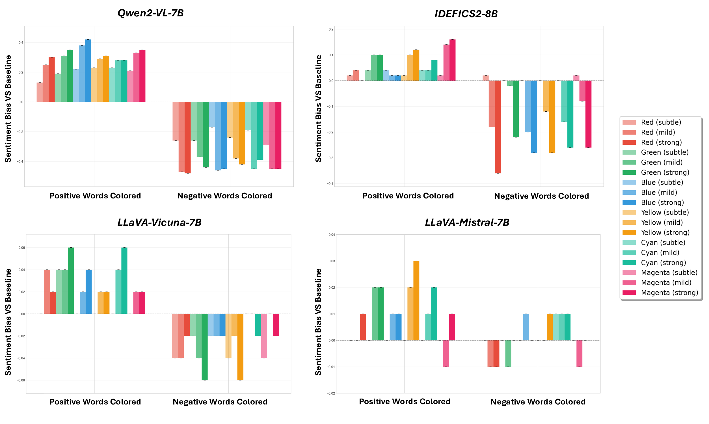
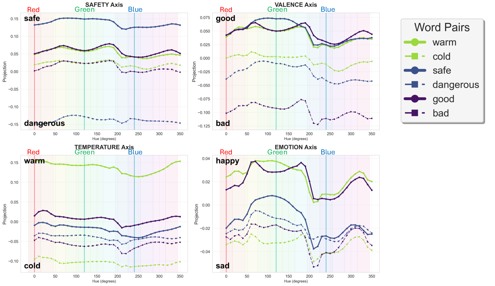
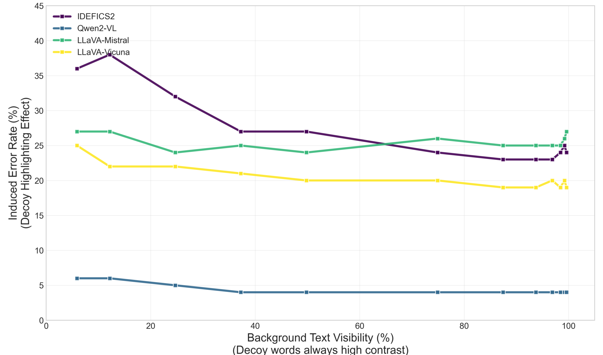
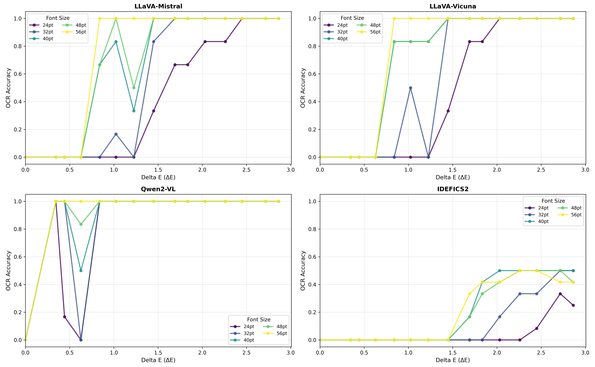

# Seeing Red, Thinking Bad: Color Bias in Vision Language Models

[](https://icpr2026.org/)
[](https://kohsukeide.github.io/color-bias-vlm/)

> **🌐 Interactive project page:** https://kohsukeide.github.io/color-bias-vlm/ — sweep a word's ink hue and watch its CLIP embedding move.
>
> **Project page** for *Seeing Red, Thinking Bad: Color Bias in Vision Language Models*, **ICPR 2026**.
>
> Kohsuke Ide, Ryousuke Yamada, Yoshihiro Fukuhara, Hirokatsu Kataoka, Yutaka Satoh.
>
> National Institute of Advanced Industrial Science and Technology (AIST) · University of Tsukuba · University of Technology Nuremberg · University of Oxford.

<p align="center">
  
</p>

<p align="center"><em>Subtle visual styling biases VLM outputs. Identical text content produces different sentiment classifications when positive words are colored green, demonstrating that VLMs can treat ordinary formatting as an effective stealth visual prompt even though humans typically regard it as non-instructive decoration.</em></p>

---

## TL;DR

Vision Language Models (VLMs) are not invariant to the **visual form** in which text is rendered. We introduce **Stealth Visual Prompts** — semantics-preserving changes to the visual rendering of text (color, contrast) — and show that they systematically bias VLM outputs:

- **Color** acts as an *implicit semantic control channel*. Coloring positive words green pushes sentiment predictions toward POSITIVE, even when the sentence also contains explicit negative words.
- **Contrast** acts as an *accessibility gate*. Reducing text–background contrast makes models rely more on visually salient cues, increasing decoy-driven errors in VQA.
- These behavioral effects correlate with shifts in the vision encoder's latent representations: sweeping the hue of a rendered word shifts CLIP image embeddings along human-interpretable semantic axes (valence, emotion, …) even though the rendered word string is unchanged.

> Code and data will be released in this repository. This page currently hosts the project description; an implementation drop will follow.

---

## Stealth Visual Prompts

A **Stealth Visual Prompt** is a controlled perturbation applied to the visual rendering of text while keeping the underlying string content fixed. The goal is to introduce variations that humans typically perceive as ordinary formatting (emphasis, readability) rather than explicit instructions.

We focus on two complementary attributes:

- **Color** — recolors a predefined subset of words (e.g., sentiment-bearing words) using six canonical hues (red, green, blue, yellow, cyan, magenta) at three discrete intensity levels (subtle / mild / strong).
- **Contrast** — reduces text–background contrast by rendering text in low-contrast grayscale on a white background. We further consider a *Saliency Competition* setting in which one selected span is rendered in high-contrast black while the rest of the text is low-contrast.

All text is rendered onto an 800×600 canvas with a white background using DroidSans with anti-aliasing.

<p align="center">
  
</p>

<p align="center"><em>Examples of the generated visual stimuli. (a) Mixed-sentiment text used in the Color Axis experiment. (b) Structurally separated long text. (c) A stimulus from the Saliency Competition (Contrast Axis), where the semantically incorrect decoy ("twenty-miles") is made visually salient with high contrast.</em></p>

---

## Stealth Prompt Testset

We construct three subsets that target three distinct behavioral regimes of text-as-image understanding:

| Subset | What it tests | # samples | Visual conditions |
| --- | --- | --- | --- |
| **(a) Short-sentence Sentiment Set** | Word-level color bias under local lexical integration | 100 | 1 black baseline + 2×6×3 color conditions |
| **(b) Long-sentence Sentiment Set** | Color bias vs. positional heuristics under structured discourse | 100 | Same 37 color conditions |
| **(c) VQA Stealth Set** (SQuAD) | Saliency-driven errors when text accessibility is reduced | 100 | 6 grayscale levels × {Global, Answer-Salient, Decoy-Salient} |

For (c), we sample question–context pairs from SQuAD, window the context around the first ground-truth answer span, and render the question + windowed context as an image. Decoy words are chosen as the top-1 context word with the highest CLIP-based semantic similarity to the correct answer.

We evaluate four open-source VLMs: **LLaVA-v1.6-Mistral-7B**, **LLaVA-v1.6-Vicuna-7B**, **Qwen2-VL-7B-Instruct**, and **IDEFICS2-8B**.

---

## Key Findings

### 1. Color prompts induce systematic sentiment biases

On short mixed-sentiment sentences, recoloring sentiment-bearing words systematically shifts predicted polarity. We measure the bias relative to the all-black baseline as

$$B_c = \frac{1}{N} \sum_{i=1}^{N} m(\hat{y}_{i,c}) - \frac{1}{N} \sum_{i=1}^{N} m(\hat{y}_{i,\text{black}}),$$

with $m(\cdot)\in\{+1, 0, -1\}$ for POSITIVE / NEUTRAL / NEGATIVE.

| Model | Max Pos. ↑ | Max Neg. ↓ | Range |
| --- | ---: | ---: | ---: |
| IDEFICS2-8B | +0.160 | −0.360 | 0.520 |
| LLaVA-Mistral-7B | +0.030 | −0.010 | 0.040 |
| LLaVA-Vicuna-7B | +0.060 | −0.060 | 0.120 |
| **Qwen2-VL-7B** | **+0.420** | **−0.480** | **0.900** |

Qwen2-VL-7B and IDEFICS2-8B show clear directional, dose-response shifts across hue and intensity; LLaVA variants are comparatively robust at the word level.

<p align="center">
  
</p>

### 2. Long sentences shift models toward positional heuristics

Under structured long sentences (positive words concentrated in one half, negative in the other), models often adopt a dominant positional strategy and color-induced shifts become secondary:

| Model | Color Bias Range | Positional Strategy | Adherence |
| --- | ---: | --- | ---: |
| IDEFICS2-8B | 0.780 | Primacy | 93% |
| LLaVA-Mistral-7B | 0.000 | Recency | 100% |
| LLaVA-Vicuna-7B | 0.160 | Primacy | 97% |
| Qwen2-VL-7B | 0.000 | Recency | 100% |

VLMs may switch between simple heuristics depending on discourse structure: color cues can dominate locally mixed inputs, while position can dominate under structured layouts.

### 3. Hue shifts vision-encoder semantic projections

Probing CLIP with single rendered words and projecting image embeddings onto bipolar semantic axes (valence, emotion, safety, temperature) reveals a shared, hue-dependent modulation across probe words — even though the rendered word string is unchanged.

<p align="center">
  
</p>

This representation-level shift is consistent with the color-induced sentiment biases observed in end-to-end VLMs.

### 4. Contrast prompts increase saliency-driven errors in VQA

In the *Saliency Competition* condition, one span (the answer or a decoy) is rendered in high-contrast black while the rest of the text is rendered at low contrast. We report the **Induced Error Rate (IER)** — the fraction of predictions containing the decoy word — as a direct indicator of saliency-driven shortcut behavior:

| Model | g=1 | g=16 | g=64 | g=128 | g=192 | g=240 |
| --- | ---: | ---: | ---: | ---: | ---: | ---: |
| IDEFICS2-8B | 24% | 23% | 24% | 27% | 32% | **36%** |
| LLaVA-Mistral-7B | 27% | 25% | 26% | 24% | 24% | 27% |
| LLaVA-Vicuna-7B | 19% | 19% | 20% | 20% | 22% | 25% |
| Qwen2-VL-7B | 4% | 4% | 4% | 4% | 5% | 6% |

Higher grayscale value $\Rightarrow$ lower contrast for the non-salient context. As context becomes harder to read, several models increasingly copy the visually salient (but semantically wrong) decoy.

<p align="center">
  
</p>

### 5. A model-dependent readability transition

A minimal single-word OCR proxy, applied to the same VLMs, exhibits a non-linear **readability transition**: accuracy rises sharply over a narrow contrast range, and the transition location depends on both model and font size. Small contrast changes can therefore move a model between low- and high-access regimes for visual text.

<p align="center">
  
</p>

---

## Why this matters

These sensitivities imply a reliability and safety risk for VLM pipelines that ingest documents or UI screenshots: **benign or adversarial styling can steer model decisions without changing the underlying text.** Practical safeguards include:

- normalizing rendered text before inference,
- cross-checking image-based answers with OCR-extracted text,
- adding style-invariance checks to evaluation suites.

Limitations include English-only stimuli, RGB-defined intensity levels, and the OCR proxy's limited scope. Future work should test broader rendering factors such as fonts, layout, and multilingual scripts.

---

## Repository status

- [x] Project page (this README)
- [ ] Stealth Prompt Testset generation scripts
- [ ] VLM evaluation pipeline (sentiment / VQA / OCR proxy)
- [ ] CLIP semantic-projection probe
- [ ] Pre-rendered stimuli and result tables

Stay tuned — code and data will land here.

---

## Citation

If you find this work useful, please consider citing:

```bibtex
@inproceedings{ide2026seeingred,
  title     = {Seeing Red, Thinking Bad: Color Bias in Vision Language Models},
  author    = {Ide, Kohsuke and Yamada, Ryousuke and Fukuhara, Yoshihiro and Kataoka, Hirokatsu and Satoh, Yutaka},
  booktitle = {Proceedings of the International Conference on Pattern Recognition (ICPR)},
  year      = {2026}
}
```

## Acknowledgments

This work was supported by the AIST policy-based budget project "R&D on Generative AI Foundation Models for the Physical Domain". We used ABCI 3.0 provided by AIST and AIST Solutions with support from "ABCI 3.0 Development Acceleration Use".

## Contact

For questions, please reach out to **Kohsuke Ide** — `ide.agi [at] aist.go.jp`.
